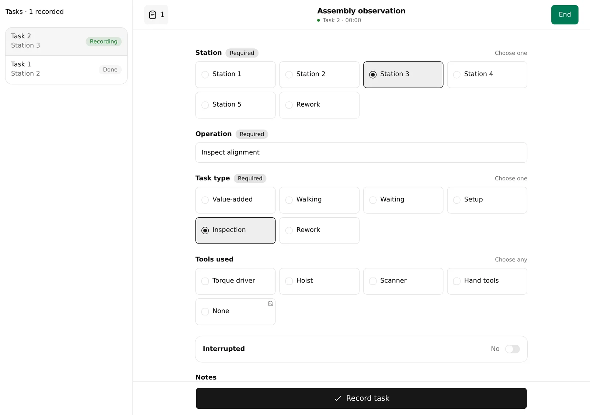

# optio

Optio helps you study how time is spent on tasks. Create a set of questions,
record observations as you work, then review sessions and export them as CSV.

[Open Optio](https://mariusom.github.io/optio/). It works on phones, tablets and
computers, and can be added to your home screen. After the first visit finishes
loading, you can use it offline. No account is needed.

Studies stay in your browser, with no automatic backup or sync. Clearing site
data can erase them, so export important results. Optional assistant access can
share study data with an assistant provider; see [agent access](docs/agent-access.md)
before enabling it.

This is a pre-release. The current storage revision starts fresh; earlier
pre-release studies are not migrated. Export anything you want to keep from
the old build before updating.

For contributors: [development](docs/development.md),
[architecture](docs/architecture.md), and [interface conventions](docs/interface.md).

[MIT license](LICENSE) · [Third-party notices](public/THIRD_PARTY_NOTICES.txt) ·
[Security](SECURITY.md).
